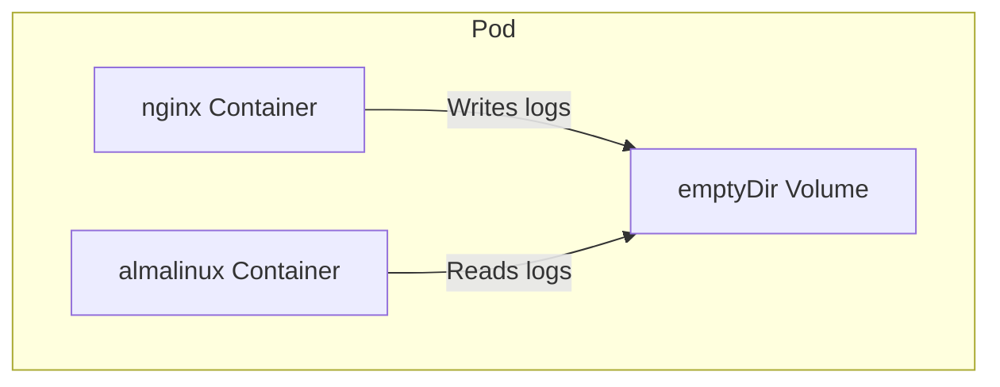

# 🚀 Kubernetes emptyDir Volume – Interview-Ready Notes

This project demonstrates how two containers in the same Kubernetes Pod share data using an `emptyDir` volume. This is a common topic in interviews and a practical pattern for real-world Kubernetes applications.

---

## 📘 Concept Overview

The core idea is to show **file sharing between containers** inside a single Pod using `emptyDir`. One container writes logs, and the other reads them—mimicking many production architectures.

---

## 🧩 What Does This Pod Do?

This Pod runs **two containers** that collaborate via a shared volume:

| Container  | Purpose            | Path Mounted        | Access     |
|------------|--------------------|---------------------|------------|
| nginx      | Writes log files   | `/var/log/nginx`    | Read-Write |
| almalinux  | Reads nginx logs   | `/mnt/nginx-log`    | Read-Only  |

- **nginx** container writes logs to the shared volume.
- **almalinux** container reads those logs using a read-only mount.

By using `emptyDir`, both containers can **share the same storage** during the Pod's lifetime.

---

## 📂 Architecture Diagram

The following diagram visualizes how the `emptyDir` volume is shared between the two containers in the Pod.



---

## 📦 What Is emptyDir?

**Interview Explanation:**

- `emptyDir` provides **ephemeral storage** for the entire Pod.
- Created when the Pod starts.
- **Deleted automatically** when the Pod stops.
- Uses **local node storage** (not persistent across Pod restarts).
- **Ideal for sharing files** between containers in the same Pod.

---

## 🛠 Common Use Cases

- Sharing logs between containers (sidecar logging)
- Caching temporary data
- Scratch space for data processing
- Monitoring/metric agents reading application output

---

## 🔒 Why Read-Only for the Second Container?

- Ensures only **nginx** writes logs, **almalinux** only reads.
- Prevents accidental modification or deletion of logs.
- Encourages **separation of responsibility** (best practice).
- Mirrors common "sidecar" logging or monitoring patterns.

---

## 📝 Key Interview Takeaways

- `emptyDir` is **non-persistent** and tied to the Pod’s lifecycle.
- Designed for **data sharing between containers** within the same Pod.
- Supports `sizeLimit` for controlling resource usage.
- Frequently used for **logging sidecars** and scratch spaces.
- Demonstrates **multi-container Pod architecture** in Kubernetes.

---

## 🚀 Deploying the Demo

Follow these steps to deploy and test the demo.

```bash
# 1️⃣ Apply the Pod YAML
kubectl apply -f emptydir-pod.yaml

# 2️⃣ Check logs inside the nginx container
kubectl exec -it empty-dir-demo -c nginx -- ls /var/log/nginx

# 3️⃣ Verify the same logs from the almalinux container
kubectl exec -it empty-dir-demo -c almalinux -- ls /mnt/nginx-log
```

---

```card
{
    "title": "Best Practice Highlight",
    "content": "emptyDir is excellent for in-Pod, ephemeral data sharing—especially for logs and sidecar use cases."
}
```

---

## 🤔 Frequently Asked Questions

- **Q:** Does `emptyDir` persist data after Pod deletion?
  - **A:** No, data is deleted when the Pod stops.
- **Q:** Can you set a storage size limit?
  - **A:** Yes, with the `sizeLimit` field in the volume spec.
- **Q:** Is data in `emptyDir` shared between different Pods?
  - **A:** No, only among containers in the same Pod.

---

## 🏁 Conclusion

This project gives a hands-on, interview-ready demonstration of using Kubernetes `emptyDir` volumes for container collaboration. It covers both the *technical implementation* and the *rationale behind volume usage patterns* in modern cloud-native applications.