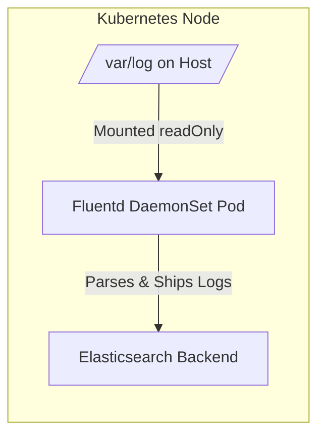

# Kubernetes Fluentd DaemonSet for Log Collection

This documentation explains how to deploy **Fluentd** as a DaemonSet in a Kubernetes cluster. Fluentd collects logs from each node and forwards them to an Elasticsearch backend, forming a core part of the EFK (Elasticsearch–Fluentd–Kibana) logging stack.

---

## 🚀 What Does This DaemonSet Do?

- **Deploys one Fluentd pod per node** using a DaemonSet.
- **Collects logs** from the host machine’s `/var/log` directory.
- **Forwards logs to Elasticsearch** (configured within Fluentd).
- **Runs on** both worker and control-plane nodes (thanks to tolerations).

---

## 📂 Architecture Overview

Below is a clear depiction of how Fluentd interacts with the host system and forwards logs to Elasticsearch:



- **Fluentd Pod** reads logs from `/var/log` via a read-only hostPath mount.
- **Logs are parsed and shipped** to Elasticsearch for storage and analysis.

---

## 📦 Why Use a DaemonSet?

- Ensures **exactly one Fluentd pod per node**.
- **Automatically schedules** a pod on new nodes.
- **Removes pods** when nodes are removed.

This makes DaemonSet ideal for **node-level log collection**.

---

## 🧩 Key Concepts in the YAML

| Concept        | Description                                                                                                  | Example YAML                                      |
|----------------|--------------------------------------------------------------------------------------------------------------|---------------------------------------------------|
| **hostPath**   | Mounts `/var/log` from the host node into the container for log collection.                                 | `hostPath: path: /var/log`                        |
| **readOnly**   | Ensures Fluentd can **only read** logs, not modify them.                                                     | `readOnly: true`                                  |
| **Tolerations**| Allows scheduling on **control-plane/master nodes** by tolerating their taints.                              | See `tolerations` section in YAML                 |
| **Resources**  | Allocates specific **CPU/memory** to Fluentd for reliable operation.                                         | `resources: limits/requests`                      |

---

## 📜 Full DaemonSet YAML (With Explanations)

This is a commented example of the DaemonSet deployment manifest:

```yaml
apiVersion: apps/v1
kind: DaemonSet
metadata:
  name: fluentd-elasticsearch
  namespace: kube-system
  labels:
    k8s-app: fluentd-logging
spec:
  selector:
    matchLabels:
      name: fluentd-elasticsearch
  template:
    metadata:
      labels:
        name: fluentd-elasticsearch
    spec:
      tolerations:
        # Allow Fluentd to run on master/control-plane nodes
        - key: node-role.kubernetes.io/control-plane
          operator: Exists
          effect: NoSchedule
        - key: node-role.kubernetes.io/master
          operator: Exists
          effect: NoSchedule
      containers:
        - name: fluentd-elasticsearch
          image: quay.io/fluentd_elasticsearch/fluentd:v5.0.1
          resources:
            limits:
              memory: 200Mi
            requests:
              cpu: 100m
              memory: 200Mi
          volumeMounts:
            - name: varlog
              mountPath: /var/log
              readOnly: true # Fluentd must only read logs
      terminationGracePeriodSeconds: 30
      volumes:
        - name: varlog
          hostPath:
            path: /var/log # Host path containing logs
```

---

## ▶️ How to Deploy Fluentd DaemonSet

Follow these steps to deploy and verify your Fluentd DaemonSet:

1. **Apply the DaemonSet:**
   ```bash
   kubectl apply -f fluentd-daemonset.yaml
   ```
2. **Check DaemonSet status:**
   ```bash
   kubectl get daemonset -n kube-system
   ```
3. **List Fluentd pods on all nodes:**
   ```bash
   kubectl get pods -n kube-system -o wide
   ```
4. **View Fluentd pod logs:**
   ```bash
   kubectl logs -n kube-system daemonset/fluentd-elasticsearch
   ```

---

## 📝 Key Takeaways for Interviews

- **DaemonSet** runs one pod per node for consistent log collection.
- **Fluentd** is a highly flexible log collector and shipper.
- **hostPath** volumes enable reading from the node’s filesystem.
- **Tolerations** permit running on control-plane/master nodes.
- **readOnly** mount ensures logs are not altered.
- **Common use** in the EFK log management stack.

---

```card
{
    "title": "Best Practice: ReadOnly Logs",
    "content": "Always mount host logs as readOnly to protect them from accidental modification by log collectors."
}
```

---

## Frequently Asked Questions

### Why use hostPath instead of an emptyDir or other volume?
- **hostPath** gives the container access to the node’s actual log files. Other volume types would not provide access to host logs.

### Is it safe to run on control-plane nodes?
- With proper resource limits and tolerations, running Fluentd on control-plane nodes is safe for small to medium clusters. For very large clusters, isolate logging workloads as needed.

### Can I forward logs to something other than Elasticsearch?
- Yes! Fluentd supports many outputs, including Kafka, Amazon S3, and others. Just update the Fluentd configuration inside your container.

---

## Summary Table

| Feature               | Value                                                         |
|-----------------------|--------------------------------------------------------------|
| **Log collector**     | Fluentd                                                      |
| **Deployment method** | DaemonSet                                                    |
| **Log source**        | /var/log (via hostPath)                                      |
| **Log destination**   | Elasticsearch (configurable)                                 |
| **Node coverage**     | Worker nodes + Control-plane nodes (via tolerations)         |
| **Security**          | readOnly mount; resource limits set                          |

---

## EFK Stack Placement

Fluentd as a DaemonSet is a crucial link between **Kubernetes nodes (log sources)** and the **Elasticsearch backend**. It enables scalable, reliable log collection in Kubernetes environments.